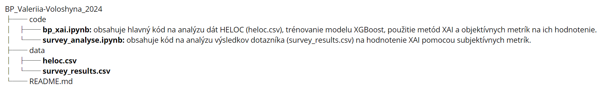

Tento kód predstavuje praktickú časť bakalárskej práce v oblasti umelej inteligencie, nazývanej **"Porovnanie rôznych metód vysvetliteľnosti modelov umelej inteligencie na zvolenej množine dát"**

**Hlavným cieľom** tejto práce je zvýšiť dôveru ľudí voči systémom umelej inteligencie pomocou metód Explainable AI (XAI). 

Na tento účel bol vyvinutý model umelej inteligencie, založený na dátach <a href="https://www.kaggle.com/datasets/averkiyoliabev/home-equity-line-of-creditheloc?resource=download">HELOC</a> od spoločnosti <a href="https://community.fico.com/s/explainable-machine-learning-challenge">FICO</a>, a jeho výsledky boli analyzované pomocou metód XAI, aby sa zabezpečilo pochopenie a vysvetlenie rozhodnutí prijatých modelom.

# Obsah projektu: 

